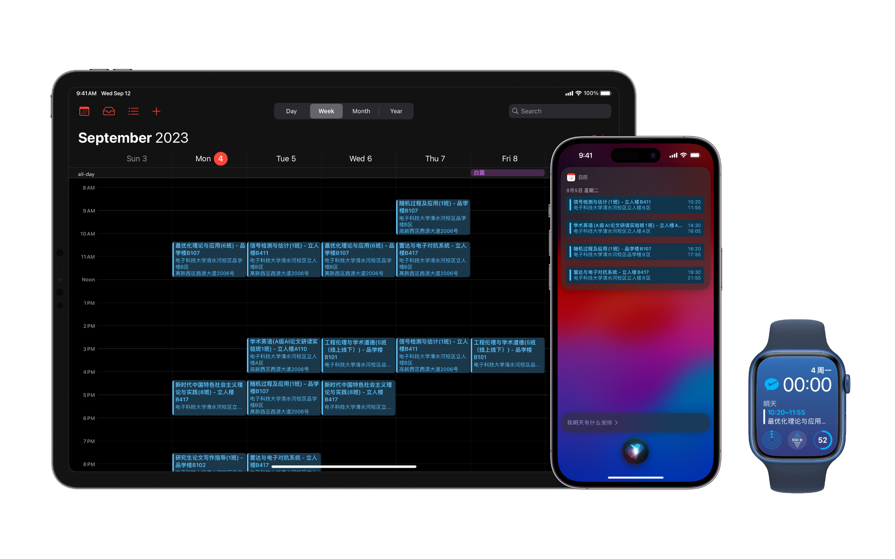
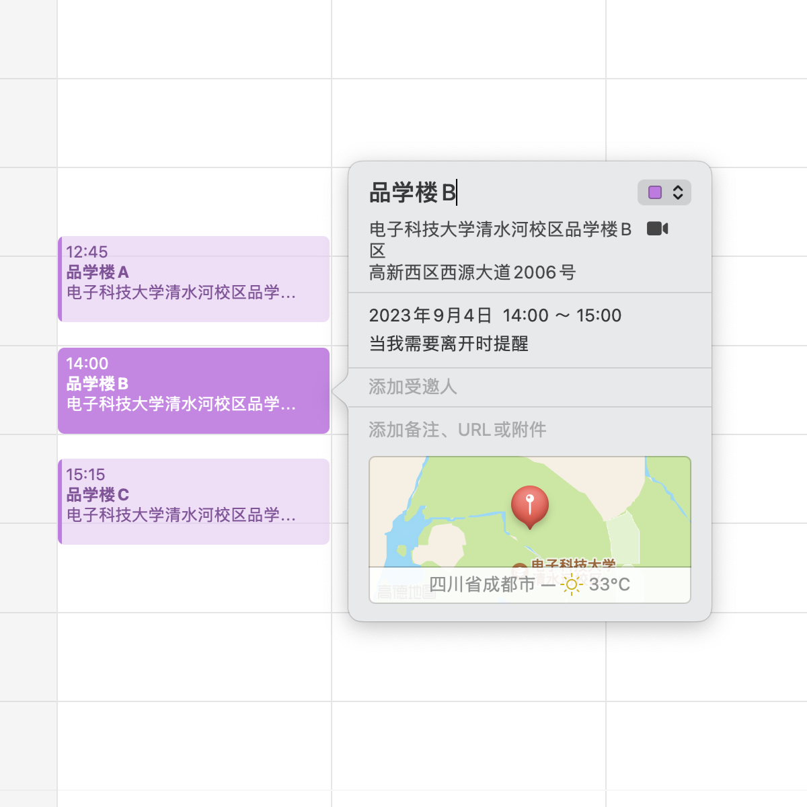

## Python 大学生课表 (.ics) 生成



iCalendar 是广泛使用的日历数据交换标准，在诸如 Apple 日历、Google Calendar 的日历 app 中创建日历项，不仅可清晰的了解日程安排，更可体验 iOS、Android 系统为日历提供的各种功能：计划出行时间、日程提醒、如 Siri 与 Google Assistant 等智能语音助理自动化服务等

并非所有学校都为学生提供 ics 日历，因此本代码旨在用 Python 3 协助你创建一个自己的基础 ics 日历课表

* 兼容 Apple 日历、Google Calendar、Outlook Calendar 等日历应用，支持日历订阅
* 支持多种课程时间安排：如「第2周，5 至 11 周中的单数周，13 至 17 周」
* 支持添加教学楼信息，其中 Apple 日历还支持教学楼 Apple Maps 定位 ，在日历项中添加教学楼，就可在多个 iOS 地图等 app 中获得附加功能，如建议出发时间等
* 导入到系统日历后，支持诸多由操作系统提供的日历功能：例如，在 iOS 设备中添加日历项后，你可以直接向 Siri 询问：「我下周五有什么日程？」获得下周五的课表；或是在 Apple Watch 表盘上显示下一个课程的时间；或是使用 Shortcut 捷径进行更多操作


**在源代码设计上：**

* 使用面向对象思想，对希望创建的课表日历项的标题、介绍内容高度可控
* 使用 Python 自带的 `re`、`datetime` 和 `hashlib` 库，无需任何第三方依赖
* 所有函数均添加了 Python 的 `typing` 类型注解支持，便于快速检查代码正确性


## 简单使用

库中有两个代码文件：

* `main.py` 主函数代码，请在这里输入你的课表信息
* `data.py` 功能实现代码，如果需要定制你的课表，尝试修改这里的代码

请参考 `main.py` 中的示例代码进行修改

#### 录入课程

每一个课程都是一个 `Course` 实例，包括以下属性：

* 课程名称
* 课程教师名
* 上课地点（教室名、定位信息）
  * 教室名（字符串）显示在标题中便于快速查看教室位置
  * 通过 `Geo` 实例可设置经纬度坐标定位信息（详见后文）
  * 通过 `AppleMaps` 实例可设置 Apple Maps 定位信息（详见后文）
  * 如果无需设置定位信息，留为空项（空字符串、`None` 等）即可
* 上课时间（周数、星期、节数）
  * 通过 `Course.week()` 函数可设置批量周数，如 1-13 周
  * 通过 `Course.odd_week()` 函数可设置奇数周、`Course.even_week()` 设置偶数周
  * 周数、节数都是数字数组，可简单的通过加法进行拼合

例如：张三老师的信号检测与估计在第一周和 3 到 13 周中的奇数周的星期五第 7、8、9 节在立人楼B411上课

```python
Course(
  name = "信号检测与估计",
  teacher = "张三",
  classroom = "立人楼B411",
  location = None, # 定位信息的设置方式详见后文
  weekday = 5, # 星期五则为 5，星期日则为 7
  weeks = [1] + Course.odd_week(3, 13),
  indexes = [7, 8, 9] # 或者 Course.week(7, 9)
)
```

请在 `main.py` 中设置你的所有课程，请留意相同课程在不同天多次开设的，需多次录入

#### 设置学校信息

为了计算每节课的准确时间，你还需要录入学校信息到一个 `School` 实例，包括：

* 每节课的时间长度（不包含课间休息）
* 每节课开始上课的时间（24 小时制）
* 开学第一周星期一的日期

例如：以电子科技大学 2023 至 2024 学年度上期的情况为例

```python
School(
  duration = 45, # 每节课时间为 45 分钟
  timetable = [
    (8, 30), # 上午第一节课时间为 8:30 至 9:15
    (9, 20),
    (10, 20),
    (11, 10),
    (14, 30), # 下午第一节课时间为下午 2:30 至 3:15
    (15, 20),
    (16, 20),
    (17, 10),
    (19, 30),
    (20, 20),
    (21, 10),
  ],
  start = (2023, 8, 28), # 2023 年 8 月 28 日是开学第一周星期一
  courses = [] # 这里放入刚刚录入好的全部课程
)
```

请在 `main.py` 中设置你的学校信息，并在 `courses` 参数中传入刚刚录入的课程，然后运行即可生成！


## 自定义课表日历

如果你希望进一步定制课表，你可以修改 `data.py` 中各对象的实现函数

#### Course 对象

##### 日历的标题

你可以通过修改 `Course.title()` 函数设置每节课的标题，默认为 `{课程名} - {教室名}`

##### 日历的详细信息

你可以通过修改 `Course.description()` 函数设置每节课的标题，默认为 `任课教师：{教师名}。`

如果你想在详细信息中包含类似于「当前是第 X 周」这样不停变化的信息，可在字符串中设置待格式化文本，例如 `当前是第 {WEEK} 周`，然后在 `School.generate()` 函数中将其正确的格式化

#### 经纬度定位信息

除了通过文字记录教室的名称，你还可以设置日历项发生的位置，并绑定经纬度坐标信息

***请注意：**如果你使用的是 Apple 设备（iPhone、iPad、Apple Watch、Mac），此功能只能用于添加地理位置名称，经纬度功能无效，请参照下一章节配置 Apple Maps 定位信息，这将使你的日历和 Apple Maps 系统地图相关联*

为了方便记录位置信息，代码设计了 `Geo` 对象，包含地理位置的名称和经纬度，例如

```python
立人楼A = Geo("电子科技大学清水河校区立人楼A区", 30.749454, 103.932191)
立人楼B = Geo("电子科技大学清水河校区立人楼A区", 30.748903, 103.931567)
```

在创建 `Course` 对象时，紧随教室名称（字符串）参数之后，有名为 `location` 的参数，请传入 `Geo`

```python
Course(
  name = "信号检测与估计",
  teacher = "张三",
  classroom = "立人楼B411",
  location = 立人楼B, # 传入 Geo 实例
  weekday = 5,
  weeks = [1] + Course.odd_week(3, 13),
  indexes = [7, 8, 9]
)
```

这样，你的课表在创建时，该课程就会包含日历地理位置以及经纬度信息了！

#### Apple Maps 定位信息

如果你使用的是 Apple 设备，你可以关联 Apple 地图中的地理位置

请首先新建一个日历 *（日历就像一个文件夹，各个日历项是文件夹中的文件）*，并创建一些日历项，这些日历项的标题应该具有可辨识性，并正确的选择你希望绑定的 Apple Maps 地点



例如，图中分别创建了名为「品学楼A」「品学楼B」「品学楼C」的三个日历，并在创建时绑定正确的地理位置信息。各个日历项中只有名字和地点是重要的，日历项的时间并不重要

然后，导出这个新创建的日历（如果你刚刚没有新建日历，而是在既有的日历上创建，导出的文件可能会很大）

* 在 Mac 上，你只需要选择正确的日历，并点击顶部菜单栏中的「文件」—「导出」—「导出」，你将获得一个 ics 日历文件。

* 在 iOS 设备上，你可以点击日历 app 底部的「日历」，在创建的日历旁点击「信息按钮（i）」—「公开日历」—「共享链接」，你将获得一个以「webcal」开头的链接，形如：

  ```
  webcal://p104-caldav.icloud.com/published/2/MTAwODY0MzQ4NTkxMDA4NqXmCG2NJ1rtWecnauQ4SvQMndZ7ZEFl92pxFh...
  ```

  请将 `webcal` 替换为 `https`，就可以在电脑上下载到刚刚在 iOS 设备上创建的 ics 日历文件

在 `main.py` 中，请读入这一 ics 日历文件，代码将自动识别其中的所有日历项和对应的地址

```python
品学楼地图 = AppleMaps("UESTC.ics") # 传入文件路径
```

稍后使用时，请将这一 `AppleMaps` 实例视为一个 Python 字典，用取键值对的方式获取它，例如

```python
Course(
  name = "信号检测与估计",
  teacher = "张三",
  classroom = "品学楼B411",
  location = 品学楼地图["品学楼B"], # 对应刚刚的「品学楼B」日历项目
  weekday = 5,
  weeks = [1] + Course.odd_week(3, 13),
  indexes = [7, 8, 9]
)
```

请注意名称需要严格和日历项的名称一致，如果找不到对应的日历项，将产生运行时异常

本库中已经包括了一个参考日历文件 `UESTC.ics`，你可以动手一试

这样，你的课表在创建时，该课程就会包含正确的 Apple Maps 定位信息了！


## 联系作者

* 直接提交 Issue
* 微博 [@赛艇的同学](http://weibo.com/u/3566216663 "@赛艇的同学")

